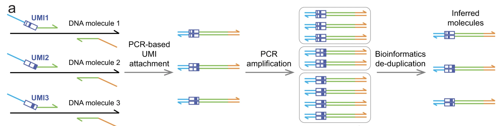

# QASeq

## Description
QASeq (quantitative amplicon sequencing) is a PCR-based molecular barcoding NGS workflow, published as an [article](https://doi.org/10.1038/s41467-022-29487-y) on Nature Communications. This code base provides a bioinformatics pipeline for analyzing sequencing data generated with QASeq, with formatted tables and figures as outputs. 
Scheme of QASeq workflow

## Install (Linux x64 or Mac Intel chip)

#### 1. Install Miniconda if not installed already ([quick command line install](https://docs.conda.io/projects/miniconda/en/latest/#quick-command-line-install))

#### 2. Create a new Conda environment named "qaseq" and install packages needed
```
conda create -n QASeq pysam bowtie2 biopython matplotlib-base seaborn pandas scipy xlrd xlwt openpyxl pytables tqdm jupyterlab --channel conda-forge --channel bioconda --channel defaults --strict-channel-priority
```
#### 3. Activate the environment
```
conda activate QASeq
```
#### 4. Clone this repository and install QASeq
```
git clone https://github.com/mxwang66/QASeq.git
cd QASeq
python -m pip install . --no-deps --no-build-isolation --no-cache-dir
```

## Dependencies
```
python >=3.8
pysam
bowtie2
biopython
numpy
pandas
seaborn
matplotlib
scipy
xlrd
xlwt
openpyxl
pytables
jupyterlab
tqdm
```


## Usage

### Input files

 - Design spreadsheet (example: `Olivar-multi preliminary design 102723-2 formated.xlsx`).

 - `.fastq.gz` outputs from sequencer (paired-end, Illumina sequencer). 

#### 1. Create an empty folder for the NGS run
e.g., a directory named `20240830_test_run`

#### 2. Make a copy of `run-analysis.ipynb` inside the run folder

#### 3. Place all `.fasta.gz` files in the `raw_reads` folder, under the run folder
e.g., `20240830_test_run/raw_reads`

#### 4. Activate Conda environment and start JupyterLab
```
conda activate qaseq
jupyter lab
```

#### 5. Navigate to the run folder, open `run-analysis.ipynb` and follow the instructions
Input your library names and path to the design spreadsheet, as well as other parameters. 
